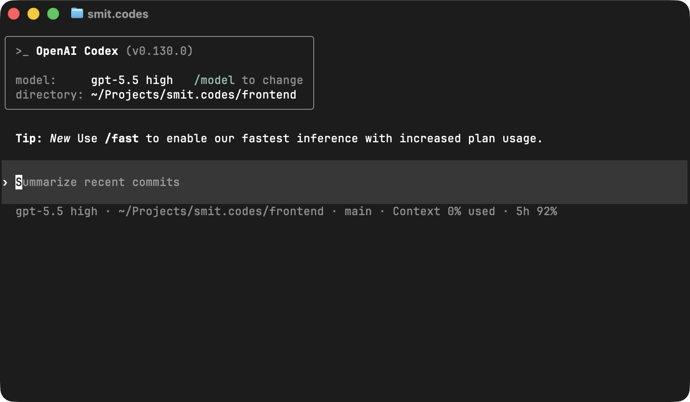

## Introduction

I recently got a one-month free trial to ChatGPT Plus, which included access to
their flagship coding agent, [Codex](https://chatgpt.com/codex). I've been using
it over the past few weeks, and I wanted to share my experience with the agent.

I started using Codex because I had seen all the hype around people using Claude
Code, Codex, and other agents to rapidly develop, test, and review code for
their applications. This type of productivity was astounding, and I had to take
a look to see what all the hype around coding agents was. Getting a trial for
Codex was my opportunity to do so. It's safe to say -- it did not disappoint.

## What's Different?

### What's an Agent?

Codex is a coding AI **agent**, not just a chatbot. It can do more than just
answer questions. When I'm using it through the Codex CLI, it runs on my device
and has access to the files in my project. That means it can inspect my
codebase, make edits, run commands, and continuously plan and iterate toward a
goal. Essentially -- it can perform tasks on my computer for me. If you want to
learn more, you can read
[this article](https://www.ibm.com/think/topics/ai-agents)

Agents also have features that normal chatbots usually do not, such as **agent
skills**, **MCP servers**, and **hooks**. These make agents more customizable
and better at working inside specific workflows, helping them truly integrate as
part of the development process. I will talk more about these later.

### Why Is It Different?

Unlike copy-pasting code from ChatGPT into my IDE or coding manually, Codex
dramatically sped up the process. When I'm working on a project, I can just use
the Codex CLI to plan out the implementation of a feature, and Codex will come
up with a plan, edit files to make changes, run tests, and iterate until the
feature is implemented. I can ask it to make adjustments or give it design
specifications, and it will consider those and make changes accordingly. The big
difference is that it helps me move from idea to implementation significantly
faster than if I were simply coding manually.

Codex has helped me greatly with implementing new features, debugging errors,
refactoring messy code, and writing docs.

## My Workflow

1. I write a clear specification of the feature I want implemented. I make sure
   it's not too broad or too narrow so Codex can do its best work.
2. If Codex has not indexed the repo before, I will run `/init` to create an
   `AGENTS.md` file, so Codex understands the codebase.
3. In Plan mode, I will give it the spec and Codex will generate a plan. I'll
   review the plan to make sure it looks good. Plan mode should definitely be
   run with high reasoning. If the feature is complex, I will ask Codex to
   utilize subagents.
4. Codex implements the plan across the codebase.
5. Test the feature. If anything seems off, re-prompt Codex with the specific
   issue.
6. Ask Codex to run tests, clean up the implementation, and simplify the code.
7. Manually review the diff to ensure the code is correct, readable, and aligned
   with the project.

### Skills, MCP Servers, and Hooks

I use various **skills**, from frontend design to documentation workflows and
git commit messages. Skills are useful because they let Codex follow reusable
instructions for specific tasks instead of me redundantly typing in the same
instructions every time. The extra context helps it become a "master" in the
task it's doing.

:::info Want to find skills?
You can find a whole list of skills here: [skills.sh](https://skills.sh)
:::

**MCP servers** are also useful because they let Codex access external tools and
data sources. They let it pull data from other sources, not just the codebase,
which makes it smarter and lets it interact with other systems, like Figma or
GitHub.

**Hooks** are also a powerful part of the workflow because they let Codex run
commands automatically, every single time. An example of a hook would be: after
a feature implementation, Codex can run a linter and formatter to automatically
lint and format the code. This helps keep the codebase clean and Codex will do
it every time.

## What Codex Does Well

Codex works best when I have a clear idea of what I want but need help turning
that idea into working code. It's really good at taking a specification,
indexing the codebase, figuring out a plan, and implementing that plan by
identifying which files need to change.

Codex is also excellent when reviewing code generated by other people and agents
(like Claude Code). It can catch subtle details within the code that are easy to
miss, such as inconsistent patterns, unnecessary complexity, or code that
doesn't fit the styling of the project.

Codex is also great with debugging and cleanup. It can read error messages,
inspect the related code, find the issue causing the error, and suggest or apply
a fix. It's also a big help in refactoring messy code: it helps simplify
functions, update documentation, and optimize code.

### Real Example: Refactoring Conversia

Codex greatly helped me when it came to refactoring my project,
[conversia](https://github.com/smit4k/conversia), a Discord bot focused on file
utilities. I used Codex to come up with a plan to refactor my codebase for
improved performance, security, and readability. Codex changed files, iterated
through the plan and utilized subagents and successfully turned hours-long work
into just a few minutes. The code had left the codebase neatly organized, safer,
faster and much easier to maintain. And it did so while only taking up about 8%
of my 5-hour usage! This degree of productivity is exactly why Codex has become
such a useful part of my workflow.

## Why I Prefer Codex for My Workflow

I know people are pretty split between Codex and Claude Code, but here are a few
reasons why I prefer Codex for my workflow:

1. Higher usage limits, and usage limits aren't shared between chatgpt.com and
   Codex.
2. Nicer CLI/TUI. The Codex CLI is
   [open-sourced](https://github.com/openai/codex), written in Rust, and it
   feels much more polished than Claude Code.
3. ChatGPT Plus gives you access to custom GPTs, and image generation.

Overall, Codex is a better fit for my workflow. It's a strong coding agent with
great capabilities.

## What Codex Still Needs Help With

Believe it or not, AI agents are **not** perfect. I still often see Codex
needing help with these things:

- Frontend design. While Codex can build functional frontend code, from my
  experience, Claude is better in this regard.
- Vague prompts. This is a problem with every agent, but Codex does not know how
  to handle vague prompts very well.
- Super complicated prompts. It struggles with prompts that are too complicated
  or prompts that try to solve too many things at once.

## Conclusion

Codex is a great tool, but it simply isn't a replacement for understanding code.
It works best when I know what to build, can review Codex's changes, and can
guide it. That's what makes Codex so useful to me. It doesn't completely remove
the programmer from the process -- it simply makes the implementation loop
faster. I spend less time fighting boilerplate, syntax errors, and repetitive
code, and I can spend that time thinking about the actual problem I'm trying to
solve.

The devs who get the most out of Codex are not the _"vibe coders"_, they're the
problem solvers who understand code and use agents to move faster.
